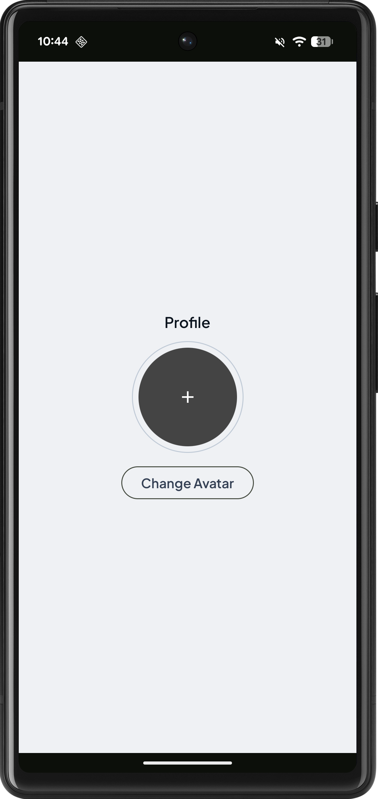
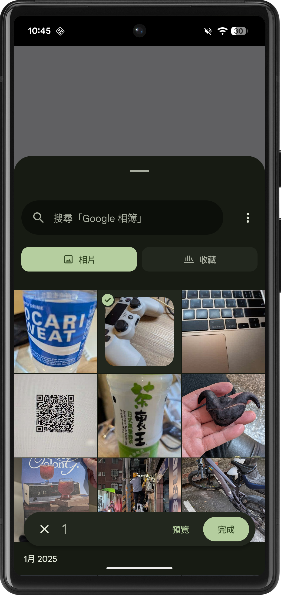
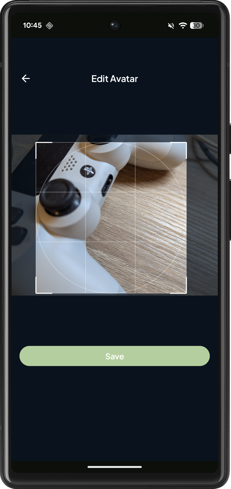
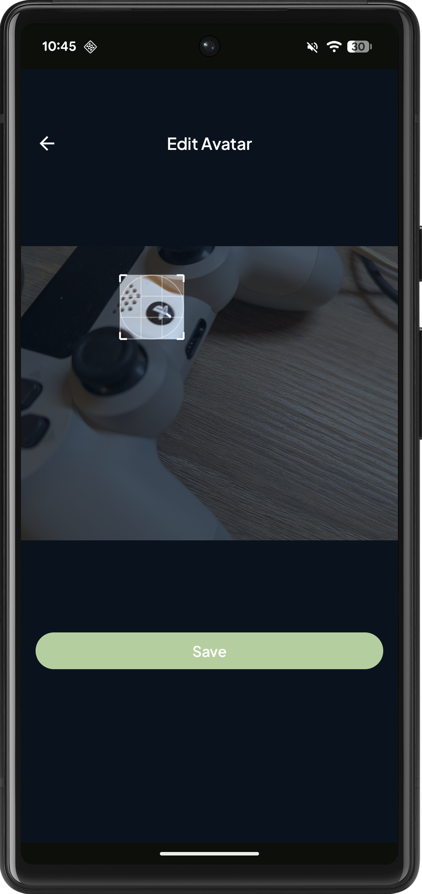
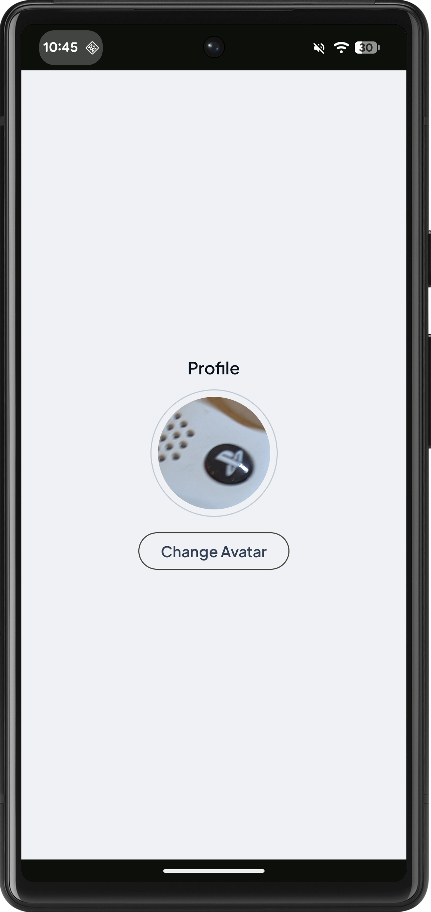

# ProfileEditor

ProfileEditor is a modern Android application built with Jetpack Compose that allows users to manage their profile avatar. It provides a seamless experience for selecting images from the device, cropping them with intuitive gestures, and updating the user's profile picture.

## Features

- **View Profile:** Display the current user avatar.
- **Image Selection:** Pick images from the device's gallery.
- **Image Editor:**
  - Crop images to a square aspect ratio.
  - Pan and zoom gestures for precise adjustment.
  - Overlay grid for visual guidance.
- **Save & Update:** Save the cropped image to local storage and update the profile view.

## Screenshots

| Step 1 | Step 2 | Step 3 | Step 4 | Step 5 |
|:---:|:---:|:---:|:---:|:---:|
|  |  |  |  |  |

## Tech Stack

- **Language:** [Kotlin](https://kotlinlang.org/)
- **UI Framework:** [Jetpack Compose](https://developer.android.com/jetpack/compose)
- **Architecture:** MVVM (Model-View-ViewModel)
- **Navigation:** [Compose Navigation](https://developer.android.com/guide/navigation/navigation-compose)
- **Asynchrony:** [Coroutines](https://kotlinlang.org/docs/coroutines-overview.html)
- **Image Loading:** Custom implementation using `ImageDecoder` and `Bitmap`.

## Setup and Installation

1.  **Clone the repository:**
    ```bash
    git clone <repository-url>
    ```
2.  **Open in Android Studio:**
    -   Launch Android Studio.
    -   Select "Open" and navigate to the cloned directory.
3.  **Build the project:**
    -   Wait for Gradle sync to complete.
    -   Build the project to ensure dependencies are downloaded.
4.  **Run the app:**
    -   Select an Android Emulator or a physical device.
    -   Click the "Run" button (green play icon).
